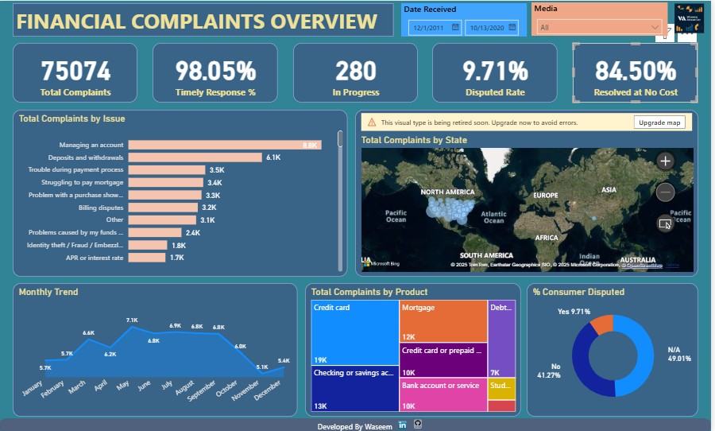

# Financial-Complaints-Dashboard
End-to-end Power BI analytics project transforming financial consumer complaint data into KPIs and interactive visuals to assess responsiveness, dispute escalation, and product-level risk.
# Financial Complaints Analysis Dashboard | Power BI

## Project Overview
This project analyzes customer complaints data from a financial institution to understand complaint volume, resolution efficiency, dispute patterns, and product-level risk areas.  
The goal is to convert raw complaint records into actionable insights that support customer service improvement, regulatory compliance, and operational decision-making.

The dashboard is built in **Power BI** using a dataset containing **75,075 records and 18 columns**.

---

## Problem Statement
Financial institutions receive a high volume of customer complaints across products, regions, and issue types.  
Without a structured analytical view, it becomes difficult to:
- Track resolution efficiency
- Identify recurring issues
- Monitor dispute escalation
- Allocate resources effectively

This dashboard provides a single, interactive view of complaint performance and trends.

---

## Objectives
- Monitor overall complaint volume and trends
- Measure responsiveness through timely response rates
- Track unresolved and in-progress complaints
- Analyze dispute escalation rates
- Understand product-wise and region-wise complaint concentration
- Support data-driven decisions for customer service and compliance teams

---

## 🔗 Live Dashboard
👉 **View Interactive Power BI Dashboard:**  
https://app.powerbi.com/view?r=eyJrIjoiNzgyMDk1M2QtZTJjOC00OTk0LTg0NTEtNTkzYzA1NzE1NDBjIiwidCI6ImZhNGZlYjhkLTNkNDItNDU4My1iNTRjLTMyYjQwNzYzMDI0NSJ9
> The live report allows users to explore KPIs, apply filters, and interact with visuals in real time.

---

## 📊 Dashboard Preview

---

## Dataset Details
- **Rows:** 75,075  
- **Columns:** 18  
- **Key Fields:**
  - Complaint ID
  - Company
  - Product
  - Issue / Sub-issue
  - State
  - Date Received
  - Date Submitted
  - Timely Response
  - Consumer Disputed
  - Submission Channel (Web, Phone, Email, etc.)
  - Resolution Status

Data was cleaned and modeled inside Power BI.

---

## Key KPIs
- **Total Complaints**  
  Tracks overall complaint volume.

- **Timely Response %**  
  Percentage of complaints responded to within the acceptable time frame.

- **In Progress Complaints**  
  Number of unresolved complaints currently being handled.

- **Disputed Rate %**  
  Percentage of complaints escalated to disputes.

- **Resolved at No Cost %**  
  Complaints resolved without monetary compensation.

---

## Visualizations Included
- **Total Complaints by Issue**  
  Identifies the most common customer problems.

- **Total Complaints by State (Map View)**  
  Highlights geographical concentration of complaints.

- **Total Complaints by Product**  
  Shows which financial products generate the most complaints.

- **Monthly Complaint Trend**  
  Tracks complaint volume over time.

- **% of Consumer Disputed (Donut Chart)**  
  Visualizes dispute escalation impact.

- **Interactive Slicers**
  - Date Received
  - Submission Channel (Web, Phone, Email, etc.)

---

## Tools & Technologies
- **Power BI**
  - Data Modeling
  - DAX Measures
  - Interactive Visuals
  - Map Visuals
- **Excel**
  - Source data formatting

---

## Key Insights Enabled
- Identification of high-risk products and issues
- Regional hotspots for customer dissatisfaction
- Efficiency of complaint handling over time
- Early signals of dispute escalation
- Workload visibility for customer service teams

---

## Challenges Addressed
- Handling a large dataset efficiently
- Ensuring date consistency and response-time calculations
- Designing visuals that balance clarity and depth
- Maintaining data privacy while analyzing complaint data

---

## Business Impact
This dashboard enables stakeholders to:
- Improve response time and resolution quality
- Reduce dispute escalation
- Strengthen compliance monitoring
- Enhance customer satisfaction through targeted interventions

---

## Files in Repository
- `Financial Complaints Overview Dashboard.pbix` – Power BI dashboard file
- `README.md` – Project documentation

---

## Author
**Waseem Ahmad Dar**  
Monitoring, Evaluation & Data Analytics Professional  
Power BI | Python | Data Analytics | Government Consulting

---

## Notes
This project is intended for analytical and portfolio demonstration purposes.  
Sensitive identifiers have been excluded from public sharing.
